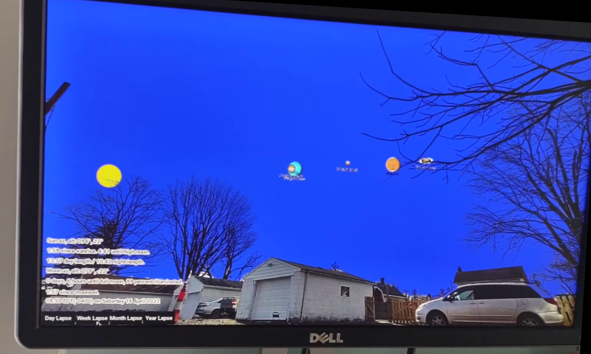

# AstroWideImageMapper
Digitally label wide-angle images of any format with with directional azimuth and altitude, to include the "shape" of the image so the angular direction of each pixel is known.

## What Already Exists
In a world of seemingly-infinite technology, some notes to avoid “re-inventing the wheel” and to enable maximum future flexibility:

JPEG, PNG, and RAW are sufficient to cover every type of human-viewable 2-D image one can imagine (at least 99% of practical applications), so let’s stick with what works already. JPEG covers an extreme range of resolutions with sufficient compression for reasonable file sizes. PNG includes transparency at the expense of larger file size. RAW covers uncompressed high-detail ignoring file size.

See list of related and similar software at:
https://timev3technology.com/astrowideimagemapper-and-related-similar-software/

Astro-photographers do this to some extent, but primarily to plan to take photos of the specific portions of the sky, not to take regular photos and later know where the stars would be or would have been.

Location (on Earth) and time data are already covered extensively by EXIF, both within the GPS section and outside of it.

EXIF data is widely distributed and well-known and includes every aspect of a photo imaginable (that is until pixel-by-pixel directional data was imagined of course). AWIM data should quickly “piggy-back” onto or be added directly to existing EXIF data.

### Altitude Digital Sensors Already Exist
Directional altitude of a photograph is easily obtainable digitally by gravity sensors that know a camera’s direction to fraction-of-a-degree accuracy. However! The data is **not included at all in EXIF** and even top-end professional cameras do not show this data to the user.
	- Professional cameras (to my knowledge) show only “level or not,” they do not give the user the actual number. This means the camera already has a sensor that knows the camera's orientation with respect to level but does not value the information enough to display it to the user or tag the photograph.
	- There exist various free “angle finder” phone apps that work great because of built-in sensors in modern smart phones.
	- Angle finders are available designed for carpentry work for about $30 at Home Depot, Amazon, etc. (annoyingly, almost all contain an extremely strong magnet designed to allow the user to stick the device to metal that is to be leveled – I was nervous about the magnet near my camera so I removed the magnet).

### Azimuth Digital Sensors Do Not Exist
Azimuth is not easy digitally. The primary physical phenomenon that would tell an electronic device its azimuth orientation is Earth’s magnetic field. Unlike gravity (and besides magnetic variation, which is easily calculable by modern computers), Earth’s magnetic field is weak and very distorted. For example, using smart phone apps and compasses alike in a relatively rural location, I tested recording azimuth values and they were +/- 30° compared to the known direction. This is already unacceptable for anything beyond walking in generally the right direction and the problem is worse in urban areas. Ironically, the magnet in the angle finder would be significant if one tried to use a compass for azimuth!

Speculation: the difficulty in azimuth is probably the sole reason directional data is not already included in EXIF. The directional altitude is not as interesting without azimuth to complete it.

Question: can GPS signals be used by a receiver with directional antennae to determine its azimuth orientation? I have never heard this question asked.

## Notes on How This Should be Done
Users should be able to calibrate their own camera with readily-available equipment. The goal is to demystify the idea of angular direction of photographs and make it available without upgrading equipment.

The data should be text. While there may be some small computer efficiency advantage to some other data format, modern computers can quickly convert text into whatever format it prefers and HUMANS CAN READ TEXT. (some EXIF data is specifically not text, and it is very annoying to work with).

## Why Label Images for Direction? Here's What's Possible
An image reprsents a single moment in time. Photographs freeze time. However, because the sky is so predictable by modern astronomy, labeling images with pixel-by-pixel directional data completes the necessary information to un-freeze photos! (in time and with respect to the sky that is). Therefore below are images of a new type of clock that uses digitally-labeled PNG images with the sky photoshopped out so celestial objects can be displayed in real time:

Above: Our back yard with sun and planets displayed where the are in real time.