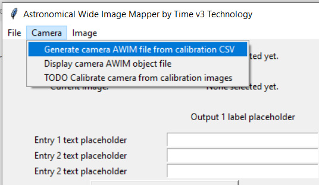
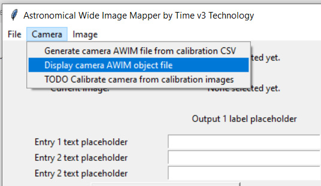
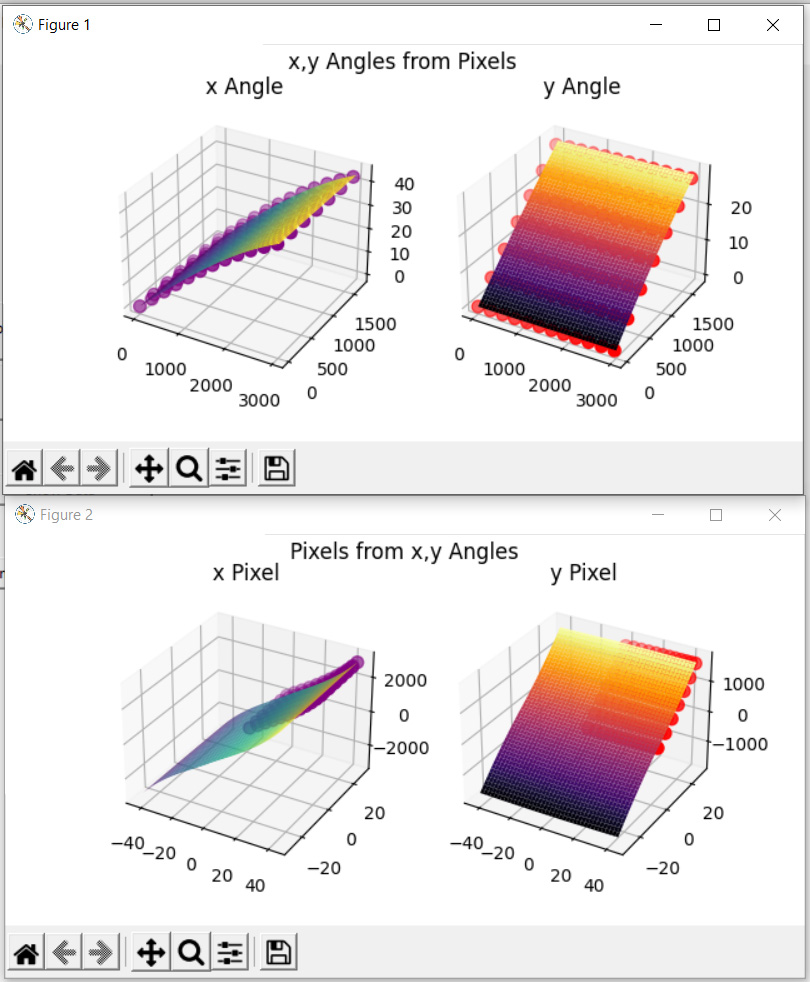
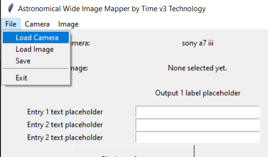
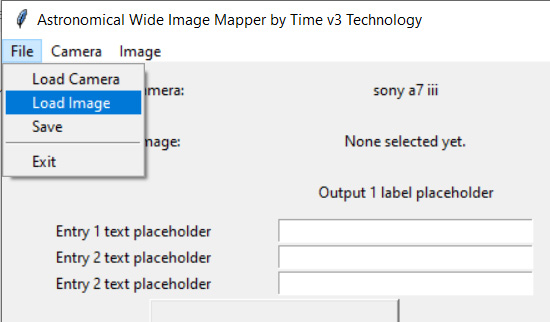
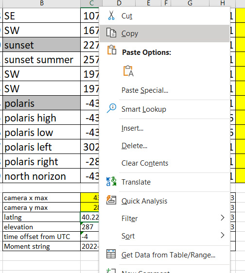
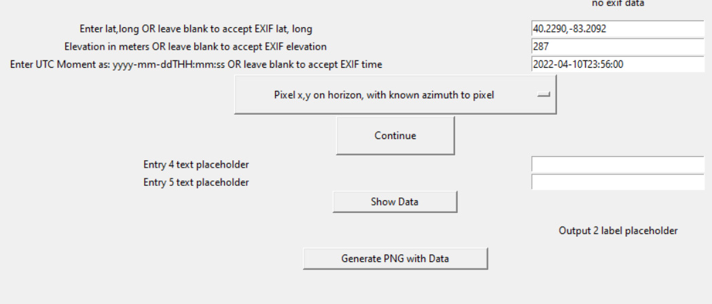
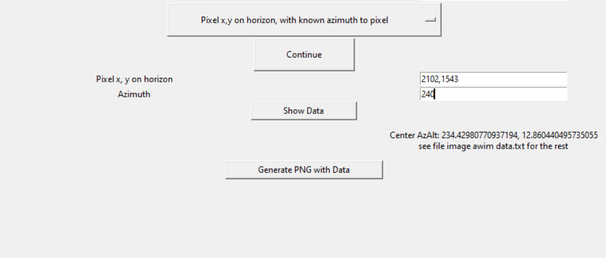

# Project Summary
## AWIM Functions
- Generate all tags to include camera and photo tags.
- Lightroom time-lapse sequences.
- Determine if celestial bodies are in the photo at given time or not and ...
	- determine if the celestial bodies are visible in the photo or behind an obstacle, like a building or tower (or even clouds as applicable). This function is the only one that requires more than the metadata from the photo. This function requires the transparency layer from the png, so there either that has to be part of the metadata somehow, or the photo has to be available "server-side"
Convert 
# Instructions
This code is intended to never have a built-in GUI. I made a GUI for it in the past, but that was a mistake because the overall goal of this project is to read from and generate files. Therefore, it works with files directly that are put into a specific hard-coded location for the code to work on. That said, I do want this code to support GUIs of all kinds as an API, and the first such "GUI" I want to support is an astronomical clock.
## To Process a Lightroom Time-Lapse Sequence
- Import the sequence of photos into Lightroom that you want to turn into a time lapse video.
- Select all photos with Ctrl+A > right-click on one photo > Metadata > Save Metadata to Files. This saves XMP files for each of the photos.
- Copy or move the XMP files to the directory `working/`
- Once the XMP files are in the directory, simply run the function `actions.lightroom_timelapse_XMP_process()`
- The XMP files will be modified in-place. It is worthwile to do so right away because the photos will have tags added to them indicating the periods of daylight like day, night, ECT, ENT, EAT, sunrise, sunset, et cetera that can be used to decide which photos to edit.
- Copy the files back to the Lightroom directory where the RAW files are, replacing the XMP files that are there.
- In Lightroom, right-click on one photo > Metadata > Read Metadata from Files.
- Using the daylight period tags, select which photos you want to use as keyframes and add the tag 'keyframe' to them.
	- You typically want to choose the beginning and end of transition periods.
	- You do NOT have to keyframe the first and last photos of the sequence because the settings for the first keyframe you select will be extended as-is to the beginnning of the sequence and likewise for the last photo you select as a keyframe, whose settings will be extended as-is to the end of the sequence.
	- You probably want to avoid keyframing photos too close to one another because it would result in a rapid transition that may not look smooth.
- Once you have tagged the keyframe photos and edited their settings as you wish in Lightroom, repeat saving metadata to XMP, processing the XMP files with `actions.lightroom_timelapse_XMP_process()`, and reading metadata from XMP files. The settings you applied to the keyframe photos will be interpolated (simple linear) and applied to the photos between the keyframe photos for a smooth transition.

## To Generate Metadata Text / JSON Files for Images
This function is not really necessary, but useful to visualize the metadata of a group of files without needing to use exiv2 or some other tool.
- Copy a group of image files to the directory `working/`, and simply run the function `actions.generate_metatext_files()`.
- Text files with the metadata will be generated and saved in `working/` along with the image files.

## To Generate a Camera awim Tag File from a Calibration Spreadsheet
- Use the calspreadsheet Excel file in `example-files`, and fill in the yellow boxes based on the reference grid. It must be named `calspreadsheet.xlsx`
- The calibration image itself is also required to be in the `working/` folder for things like dimensions. It must be named `calimage.jpg`
- Run `actions.camcalibration()`
- The output files all start with the word 'output'.
- The main output file is the `cam_awim.json` file.

## Generate awim Tags for a Photoshoot
- The information required to make an awim tag is:
- todonext: Use the photoshoot template to incorporate photoshoot tools into the app and make a database that accepts photoshoot data real-time during photoshoots.

# 27 January 2024 Resurrecting the Project with Many Updates
## Notes
- Going to standardize on dictionary representation of data and whatever text version of dictionary information is most convenient. This will be a text file of the dictionary or text file of the dictionary jsonified, or always something like a dictionary. BECAUSE, the most common text sidecar file standard is XMP, but supposedly Adobe made XMP just to avoid writing to proprietary files (XMP is a way to store Lightroom edits to RAW files, which are proprietary to the camera maker). Even XMP has limited support and not-so-wide usage. Also because the only reliable way to store metadata in PNG files is with a text data chunk stored along with the image.
- Going to operate as an API rather than as a GUI.
- Assume final product file is PNG because of transparency, but doesn't matter so much because using XMP.
- todo: Merge in the Lightroom tools from AWIM2.

## Workflow
- Take photos in RAW format.
- Process photos in Lightroom and export to PNG. The PNG files have the XMP text embedded in them as the metadata, but there is no easy way for Lightroom to export the XMP files with the PNG.
- Already made quick image file processor to extract metadata to text files. In the case of PNG, this means XML format.
- Save awim information as a separate .awimjson sidecar file.
- Abandon XML in favor of JSON, but maybe save the data with the file because I'm going to process the PNG files server-side and PIL can save text blocks in the PNG file. Check first if the PNG file maintains its quality.
- todonext: generate awim tags using photoshoot database data

- There is so much to do to go from recording the direction of a RAW image on paper to animating the movement of Earth using the data. What is first?

# Metadata Lists
## Metadata Sources
- XMP text files of XML
- XML from PNG files generated by Lightroom
- exif from jpg files
- exif from raw files
- awim from old awim png files
- awim generated by this code

## Metadata Destination
There really needs to be one format I use. For now, I am committing to not save any metadata directly to an image file because there is too much variety of how it gets saved, which would prevent the below standardization, plus with the text files it is much easier to read at any point and transfer the metadata without transferring the whole image.
- Within the code
	- dictionary that includes original metadata plus awim as applicable.
	- flattened
	- keys simplified as necessary
	- datetimes converted to ISO 8601 in Zulu with trailing Z.
	- Weird fractional values converted to float, at least any I'm going to use.
	- All awim data with a leading 'awim ' in the key.
- Save to file
	- Same dictionary from above.
	- jsonified, sorted by key name with indent of 4

# Datetime Formats
Within the code, I use numpy datetime64 because that's what Astropy uses. Datetime64 is time zone naive. It matches TAI, so offset from UTC by applicable leap seconds.
In string representation, I use ISO 8601 format to seconds precision with the trailing Z for Zulu. The only exception is in filenames, I exclude the colons in the time.

# Lightroom Time Lapse Smoothing
This feature uses XMP modification to smooth settings changes in time lapse videos processed in Lightroom.

## Notes from June 2024
Add lightroom XMP scripting: 3 parts are all completed by user in a single frame
1. read the XMPs to a spreadsheet / dataframe
2. modify the dataframe
    - sort dataframe by capture moment
    - add and delete tags, use tags for everything from keyframes to day/night to every fourth/tenth/20th photo feature
3. write the changes (changes only?) to the XMPs
 
Lightroom time lapse functions:
1.
- Read the XMPs, all of the fields of specific headings, like the heading "CRS" for example.
- Save a snapshot dataframe as CSV.
- Format the data in the dataframe to usable format, like float instead of text.
 
2.
- interpolate between keyframes
- write keywords kfstart, kfmid, kfend, flagged, night, day, civiltwilight, nauticaltwilight, astronomicaltwilight, sunset, sunrise, moonset, moonrise
- 
 
3.
- Compare changed dataframe to the snapshot and identify the differences.
- Format data as text that matches the exact format Lightroom uses.
- Write the changes.
 
Other functions:
- Modify filenames of folders full of image files.
 
README:
- Interfaces only with text within the XMP files
- User needs to use only the read from metadata and write to metadata features in Lightroom
- Screenshots from Lightroom, to include setting to save XMP files by default.
 
AWIM:
- eliminate saving metadata to RAW file requirement because it doesn't make sense.
- Camera AWIM tag should be JSON of dictionary. No pickle at all.
- generate_camera_AWIM_from_calibration should generate a JSON text file, not an image. The JSON tag should be the same for the calibration image as it is for any AWIM tagged image.
- All interface with Astropy should be with dataframes of requests, not individual requests - I think.
- Convert entirely to pyexiv2 - I think - to preserve resolution of imgages.

# AstroWideImageMapper (AWIM)
Tag wide-angle images of any format with with directional azimuth and altitude, to include the "shape" of the image so the angular direction of each pixel is known.

## The AWIM Image Tag
`Center Pixel: 1919.5, 1080.0`  
`Center AzAlt: 234.42980770937194, 12.860440495735055`  
`Pixel Map Type: 3d_degree_poly_fit_abs_from_center`  

`Pixel Models: ,xang,yang,xang^2,xang yang,yang^2,xang^3,xang^2 yang,xang yang^2,yang^3`  
`x_px_predict,38.584905478347814,-0.49913772928111927,-0.23361167902049915,0.004269052742105586,0.03189734241389466,0.008211779577004847,0.00016845560537404936,-0.00018570627227907366,-0.000426635027148814`  
`y_px_predict,0.08939787995178629,35.03435337848654,-0.005568544604793715,-0.0792450433226707,0.07711746847740988,4.824192131309246e-05,-0.00013866243031998237,0.0026786716949516176,0.0012553808475070127`  

`x,y Angle Models: ,x_px,y_px,x_px^2,x_px y_px,y_px^2,x_px^3,x_px^2 y_px,x_px y_px^2,y_px^3`  
`xang_predict,0.027900999697000196,-4.8320903221643025e-05,-4.672164634093756e-07,1.2419874715170198e-07,-1.1581467780652009e-07,-4.2914925966175626e-10,-3.637472323687963e-11,-1.0637810073821983e-11,2.9589860973440926e-11`  
`yang_predict,-0.00010357398436979292,0.028908429352751407,1.253676345206989e-07,9.082554392702318e-07,-1.8343544972548762e-06,-2.5228078090119843e-11,-8.045159590602813e-12,-4.941371754320096e-10,1.2626091171934542e-10`  

`Pixel Borders: [-1919.5  1080. ], [   0. 1080.], [1919.5 1080. ], [-1919.5     0. ], [0. 0.], [1919.5    0. ], [-1919.5 -1080. ], [    0. -1080.], [ 1919.5 -1080. ]`  
`x,y Angle Borders: [-43.2748141   28.51646629], [-0.17225613 28.26630412], [43.2748141  28.51646629], [-43.45629636   0.08733056], [0. 0.], [43.45629636  0.08733056], [-43.2748141  -28.51646629], [ -0.17225613 -28.26630412], [ 43.2748141  -28.51646629]`  
`Degrees per Hundred Pixels at Center: : 2.790026862354843, 2.8905563482103624`  

The tag contains all information required to know the direction of each pixel in an image relative to Earth.
- **Center Pixel** is explicitly defined although it is typically the actual center of the image in order to allow for images cropped non-symmetrically.
- **Center AzAlt** is simply the azimuth and altitude of the center pixel of the image.
- **Pixel Map Type** specifies the method of mapping the directional angles of the pixels. `3d_degree_poly_fit_abs_from_center` is AWIM's only mapping method, and is sufficient to map all 'normal' images, but another mapping method could be added and this attribute would be where to specify the new mapping method. As the name implies, the angle of each pixel is specified with a 3rd-degree polynomial best-fit relating the pixel distance from the center to the angular distance from the center and vice versa. The distances are `absolute` becuase images are assumed to be symmetrical both horizontally and vertically around the center, which is true for all cameras / lenses I know of.
- **Pixel Models** specifies the features of the polynomial to convert angular distance from center to pixel distance from center.
- `x_px_predict` are the coefficient values to find the x-distance from the center and `y_px_predict` are the coefficients to find the y-distance from the center. Notice there are two polynomials, each based on both x-angle and y-angle. This allows for accurate mapping of lens curving, particularly near the corners.
- **x,y Angle Models** specifies the features of the polynomial to convert pixel distance from center to angular distance from center.
- `xang_predict` are the coefficient values to find the x-angle from the center and `yang_predict` are the coefficients to find the y-angle from the center. Notice again there are two polynomials, each based on both x-pixel and y-pixel, allowing for accurate mapping of lens curving, particularly near the corners.
- **Pixel Borders** and **x,y Angle Borders** are the values along the corners and edges of the image to give a human-readable general idea of the dimensions of the image.

## What Already Exists
In a world of seemingly-infinite technology, some notes to avoid “re-inventing the wheel” and to enable maximum future flexibility:

JPEG, PNG, and RAW are sufficient to cover every type of human-viewable 2-D image one can imagine (at least 99% of practical applications), so let’s stick with what works already. JPEG covers an extreme range of resolutions with sufficient compression for reasonable file sizes. PNG includes transparency at the expense of larger file size. RAW covers uncompressed high-detail ignoring file size.

See list of related and similar software at:
https://timev3technology.com/astrowideimagemapper-and-related-similar-software/

Astro-photographers do this to some extent, but primarily to plan to take photos of the specific portions of the sky, not to take regular photos and later know where the stars would be or would have been.

Location (on Earth) and time data are already covered extensively by EXIF, both within the GPS section and outside of it.

EXIF data is widely distributed and well-known and includes every aspect of a photo imaginable (that is until pixel-by-pixel directional data was imagined of course). AWIM data should quickly “piggy-back” onto or be added directly to existing EXIF data.

### Altitude Digital Sensors Already Exist
Directional altitude of a photograph is easily obtainable digitally by gravity sensors that know a camera’s direction to fraction-of-a-degree accuracy. However! The data is **not included at all in EXIF** and even top-end professional cameras do not show this data to the user.
	- Professional cameras (to my knowledge) show only “level or not,” they do not give the user the actual number. This means the camera already has a sensor that knows the camera's orientation with respect to level but does not value the information enough to display it to the user or tag the photograph.
	- There exist various free “angle finder” phone apps that work great because of built-in sensors in modern smart phones.
	- Angle finders are available designed for carpentry work for about $30 at Home Depot, Amazon, etc. (annoyingly, almost all contain an extremely strong magnet designed to allow the user to stick the device to metal that is to be leveled – I was nervous about the magnet near my camera so I removed the magnet).

### Azimuth Digital Sensors Do Not Exist
Azimuth is not easy digitally. The primary physical phenomenon that would tell an electronic device its azimuth orientation is Earth’s magnetic field. Unlike gravity (and besides magnetic variation, which is easily calculable by modern computers), Earth’s magnetic field is weak and very distorted. For example, using smart phone apps and compasses alike in a relatively rural location, I tested recording azimuth values and they were +/- 30° compared to the known direction. This is already unacceptable for anything beyond walking in generally the right direction and the problem is worse in urban areas. Ironically, the magnet in the angle finder would be significant if one tried to use a compass for azimuth!

Speculation: the difficulty in azimuth is probably the sole reason directional data is not already included in EXIF. The directional altitude is not as interesting without azimuth to complete it.

Question: can GPS signals be used by a receiver with directional antennae to determine its azimuth orientation? I have never heard this question asked.

## Notes on How This Should be Done
Users should be able to calibrate their own camera with readily-available equipment. The goal is to demystify the idea of angular astronomical direction of photographs and make it available without upgrading equipment.

The data should be text. While there may be some small computer efficiency advantage to some other data format, modern computers can quickly convert text into whatever format it prefers and HUMANS CAN READ TEXT. (some EXIF data is specifically not text, and it is very annoying to work with).

## Tutorial
Following is the AWIM workflow from calibrating a camera through tagging an image.

### Calibrate a Camera
Select from the menu:

Navigate to the `test/` directory included and select the `.csv` file:

Apparently nothing will happen, but there should be a new file in the code directory with the extension `.awim`. This file is a pickle of the `ImageAWIMData` object. The file will be used to tag images in a later step.

The calibration .csv file was generated by recording the pixels from teh below calibration photo. The grid is only in one quadrant and the program assumes vertical and horizontal symmetry:

Also, in the `code output dump/` directory should be two files, `cal output.csv` and `ref df.csv`. `cal output.csv` is the original calibration `.csv` file **plus** the program's calculation filled in step-by-step, like a math scratchpad. The `ref df.csv` file is a `.csv` of the pandas dataframe of the data points used to make the best fit models for the `CameraAWIMData` object. These outputs make debugging a calibration easier.

### Visualize the Camera Data
You can visualize the pickled `CameraAWIMData` object file by the selecting the menu item then navigating to the `.awim` file:

You should see two plots:

Also, there should be a new file `code output dump/camera awim data.txt` that contains overall data about the camera/lens calibrated. This file would be overwritten in a future calibration, but the user can move and rename it for reference as detailed camera data.

### Use the Camera Data to Tag an Image
Select `Load camera` and select the `.awim` file:

Select `Load image` and select one of the PNG files in the `test files/` directory.

The camera and image will be displayed in the program and user is prompted to enter some more data.

Please open the `test files/photoshoot data template.xlsx` as it contains information to be copy-pasted into AWIM. Copy-paste the lat,long, use 287 for the elevation, then copy-paste the moment string into AWIM:

Should look like this after you select `Pixel x,y on horizon, with known azimuth to pixel` from the drop-down menu:

Click `Continue`, enter more data from the spreadsheet, then click `Show Data`, and you will see a computer-generated Center AzAlt for the image:

When you click `Generate PNG with Data`, a new PNG file will appear in the `test files/` directory that ends in ` - awim.png`. It is a PNG with AWIM data tagged.

Also, there should be a new file `code output dump/image awim data.txt` that contains the text of the AWIM tag. It currently includes location, capture moment, and image dimensions, which I will remove (TODO) when I update the program to transfer over all EXIF data. Also, I intend (TODO) to have this file generated with a matching filename ID alongside tagged images for users to access the data quickly.

The resulting tagged PNG has all the information required to know which direction **each pixel** was pointed relative to Earth! The information is contained in just a small amount of almost-human-readable text!

### NOTE on EXIF Data and Manual Data Entry
Originally, I wrote the code to use the EXIF data from the original image and relieve the user of entering manually, but later realized I only wanted to tag PNGs, which had been generated with Photoshop from the original JPGs (RAWs actually), and the PNGs do not contain EXIF so currently I manually enter the required data and the original EXIF gets lost in the conversion from JPG/RAW to PNG. I want to fix this by collocating the original JPG and PNG-file-to-be-tagged in a directory with an ID within their filename so the EXIF data gets used and transferred to the final tag on the PNG.

## Determining Azimuth and Why It's Worth Doing
I have made an astronomical clock clock with it in a separate project because the sky is already mapped.

AND

It would be ideal to have cameras record information from their sensors and automatically tag images with directional AzAlt data. However, currently that cannot be done for azimuth with existing sensors of Earth's magnetic field. Determining azimuth with image recognition would require extreme processing power along with even-more-extreme updated 3-D database of world imagery. I believe streamlining the user's ability to enter azimuth information would both enable directional photograph technology now and accelerate gathering the data required to automate directional photographs in the future.

The AWIM project aims to jump-start this process.

## Artifae is the "Directional Altitude"
Artifae is the Arabic word for altitude (using Roman letters). There should be a distinct word to specify the **directional altitude** as opposed to the **distance above** altitude or elevation. Having a separate word is especially helpful in a situation like the AstroWideImageMapper project where there is already a tag for the "distance above" altitude. The two would be confused without specifying which is which. I decided to use an Arabic word because azimuth is an Arabic word and azimuth and artifae are related concepts.

## ArtAz
Together, azimuth and artifae are AzArt. Astropy and most astronomers use the term "AltAz" to mean azimuth and artifae together. I prefer to put azimuth first because it's usually the first way we think of orienting ourselves.

## Standard Files Used by this Software
- C: is camera-side. I: is image-side
- C: calibration csv file. Should be renamed to match the exif filename output.
- C: calibration image with good exif from the camera / lens. Should be renamed to match the exif filename output.
- I: original images to be tagged that contain complete exif.
- I: images to be tagged that are just the image because they have lost their exif.
- I: **pickle of exif, readable (not raw), of calibration image plus AWIMtag single string in UserComment. produced and used**

## Standard Files Produced by this Software
- CI: text of exif, readable, produced with the same name in same directory as the image and simple text with new lines separating different fields.
- C: text, readable, of AWIMtag with new lines, named using the exif of the image in order to ID the AWIMtag by camera / lens
- C: text of AWIMtag single string, named using the exif of the calibration image in order to ID the AWIMtag by camera / lens
- C: cal output.csv is the "scratchpad" of the calibration calculations
- C: ref df.csv is the calibration reference data points - after adjustments - used in the best-fit model creation.
- I: **pickle of exif, readable (not raw), of calibration image plus AWIMtag single string in UserComment. produced and used**
- I: final product: copy of image file with exif from original image file plus AWIMtag in UserComment
- I: text of exif readable plus AWIMtag in UserComment with new lines, same name and directory as image to be tagged.

## TODO

- **Batch generate AWIM-tagged images:** I have been using the software and recording required information to determine Az,Art in a spreadsheet then manually transferring the spreadsheet data image-by-image using the GUI. The menu item "Batch generate AWIM files" would be the primary option I would use and does not require a GUI at all. "Batch generate AWIM files" would work best by requiring the user to collect the following files in a single directory:
	1. Spreadsheet of standard data recorded during a photoshoot. See example in test files. Spreadsheet includes a unique identifier for each photo to be processed (modern cameras already name their files sequentially therefore with a convenient unique ID). This standardized spreadsheet would effectively replace the GUI.
	2. Original photo files with the EXIF data tag (often editing software, including Photoshop, does not transfer EXIF data to exported images, especially for PNGs which only have text tags, no EXIF specifically)
	3. Image files to be tagged. Could be separate from the original photo files, only requiring that filename include the same unique ID present on the original photo filenames to relate the two and enable use of EXIF data and transfer same.
	4. The camera object AWIM file generated by this software that corresponds to the camera / lens system the photos were taken with.
	5. A satellite image of the photoshoot location oriented north that includes all the points of reference to be used to determine the azimuth of the photos.
- **Automate use of satellite image to determine azimuth orientation of images:** I have found the best way to determine azimuth for any photo is to use a satellite image of the photoshoot location that is oriented true north (Google maps not rotated for example) and use a photo editor (Photoshop for example) to give the angle of a line drawn between the point where I took the photo and the point of any object clearly visible anywhere in the photo. This option is already called `Pixel x,y on horizon, with known azimuth to pixel` but I user has to use Photoshop manually to determine the azimuth to the known pixel in the image to be tagged.
- **Automate use of multiple images chained together to celestial object to orient images.**
- **Reverse artifae source to manual when using a known pixel in the image for AzArt:** This is a simple matter of defining the artifae from the manual user input rather than from the user's guess of where the horizon was in the image. I believe this should be done because digital angle finders are really good and better than the user trying to determine where the horizon was in the photo, especially since the apparent horizon in the image could be significantly not-level from where the user took the photo, e.g. if it's a photo of a mountain or even just a fence blocks your view.
- Update `camera.represent_camera` to output a single pixel border array and pixels per degree instead of degrees per hundred pixels
- Add **Border Azimuth Artifae** to the tag. The whole purpose of AWIM is absolute direction. The absolute direction should be as practical for human use as possible.

- eliminate tkinter interface from the tagging process: so generate the AWIM tag in main and populate it gradually with awimlib
- separate out **basic functions** with **project flow**, need to know:
- current camera
- current image / image base filename
- 

- what is an unused exif tag number to use for AWIMInfo? How are individual GPS values stored under 34853 (= hex 8825)
- format conversions
+ arw > jpg: use the jpg exif data
+ arw > png: need exiv or similar to get the tag from the arw file.
+ anything > png: if the exif has rotation data, need to rotate the image and set the rotation tag to 1
+ jpg > jpg: if exif won't let me use an unused ID, then put it under user comments ID 37510
- Note: the LightRoom / (PS also?) lens aberration database could be used to convert linear approximations to actual camera models.
- **ArtAz** and artifae update name.
- correctly identify TAI time vs UTC time. What does astropy use? I think TAI.

# 21 June 2022 to do
- store camera info as a dictionary rather than as an object. Use the exif from the cal images rather than the user calibration file.
- make functions use camera dictionary info similar to image dictionary info
- continue to separate and clean functions